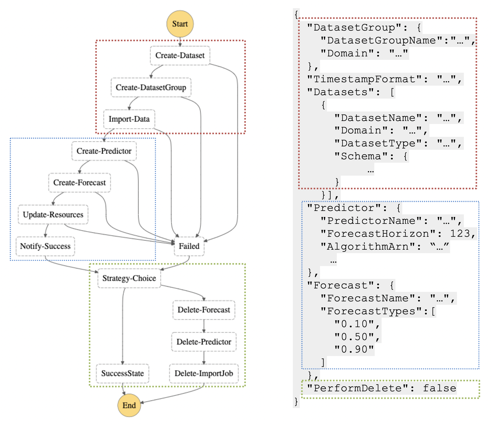

## Architecture
This directory contains the source code with a Step Function pipeline that is able to perform multiple actions within Amazon Forecast, including the following:

- Dataset creation
- Dataset import
- Predictor creation
- Forecast generation
- Data transformation

The forecast is kickstarted by first pushing the relevant parameters into SQS. One of the Lambda ("S3Lambda") will then read from the SQS. In S3Lambda, we'll first query data from Snowflake and push our target, related and validation (historical data used to compare forecast later, not necessary for the forecast step) dataset into S3. We will then fill in all the relevant parameters that AWS Forecast API will need [Refer to `s3lambda/schema.py`]. 

We'll then call onto the StepFunction API in S3Lambda that will kickstart the forecasting pipeline that'll call the relevant APIs in each Lambdas in the pipeline as seen in the image above.

Once the steps are completed, it'll export the forecast into S3 (using an AWS Forecast API). In `notify/notify.py`, we'll grab the forecast results from S3 and push them into Snowflake (remember to un-log the values, refer to "Things to note" below for more info). 

The architecture is build using a SAM Cloud Formation.

**NOTE**:
A couple differences from the original MLOps repository:
1. Can train multiple predictors per pipeline.
2. No longer push data to Athena/Quicksight, but instead pushes results into Snowflake

### Pre-requirements:

Download SAM Cli, please refer to [here](https://docs.aws.amazon.com/serverless-application-model/latest/developerguide/serverless-sam-cli-install.html) to setup your SAM Cli.

### Deploying a new architecture

To deploy a new architecture from scratch

````
chmod -R 775 .
sam build && sam deploy --guided
````

This script will read the architecture as defined in the  `template.yaml`.

You'll then fill the necessary parameters as guided above.

**NOTE:** Make sure you fill in the right Snowflake Creden


### Updating an existing architecture

``````
chmod -R 775 .
sam build && sam deploy
``````

Run this code to push any new changes

### Using the app
Either push this message into SQS 
```
{
	param: {
		'DataName': '<name>',
        	'ForecastHorizon': 90,
        	'NumberOfBacktestWindows': 2,
        	'PerformDelete': true,
        	'dateCreate': 'YYYYMMDD'
	}

}
```
OR <br />
Run directly in Lambda console (make sure to uncomment `payload = record['body']`) wiht this
```
{
	body:{
		param:{
			'DataName': '<name>',
        		'ForecastHorizon': 90,
        		'NumberOfBacktestWindows': 2,
        		'PerformDelete': true,
        		'dateCreate': 'YYYYMMDD'
		}
	}
}
```

**NOTE**: 
1. DataName should fulfill the following regex `^[a-zA-Z][a-zA-Z0-9_]*$` and shouldn't be longer than 45 characters long (instead of the original 63), as our implementation adds a few "suffixes" to the name.

### Code
`````
├── lambdas
│   ├── createdataset
│   │   └── dataset.py
│   │ 		This Lambda calls the CreateDataset API to create ARNs for 
│   │ 		them
│   ├── createdatasetgroup
│   │   └── datasetgroup.py
│   │ 		This Lambda calls the CreateDatasetGroup API to create ARNs 
│   │ 		for our forecasting group
│   ├── createdatasetimportjob
│   │   └── datasetimport.py
│   │ 		This Lambda calls the CreateDatasetImportJob API to populate 
|   |		the dataset ARNs with target/related/metadata that we supply
│   │ 		in S3
│   ├── createforecast
│   │   └── forecast.py
│   │ 		This Lambda calls the CreateForecast API to create a forecast
│   │ 		using the specified predictors
│   ├── createpredictor
│   │   └── predictor.py
│   │ 		This Lambda calls the CreatePredictor API to train the 
│   │ 		specified predictors with the data
│   ├── deletedataset
│   │   └── deletedataset.py
│   │ 		This Lmabda calls the DeleteDatasetImportJob, 
│   │ 		DeleteDatasetGroup, DeleteDataset API after the forecasts
│   │ 		and predictors are deleted!
│   ├── deleteforecast
│   │   └── deleteforecast.py
│   │ 		This Lambda calls the DeleteForecast API to delete forecasts
│   ├── deletepredictor
│   │   └── deletepredictor.py
│   │ 		This Lambda calls the DeletePredcitor API to delete predictors
│   ├── failure
│   │   └── failure.py
│   │ 		This Lambda will be use to handle error if any occurs.
│   ├── notify
│   │   └──  notify.py
│   │ 		This Lambda will first read the exported forecast results
│   │ 		in S3 and then insert the forecast results and metrics into 
│   │ 		Snowflake. It also updates the forecast_available flag
│   │ 		in the parameters table
│   └── s3lambda
│       ├── parse.py
│ 		This Lambda will first query Snowflake to get the 
│ 		target, related, metadata and validation data based on the 
│ 		parameters provided by the UI. It also here where the 
│ 		Step Function API is called to kickstart the forecasing
│ 		pipeline.
│       └── schema.py
│ 		This script will be called by parse.py to populate the schema
│ 		that will passed along the forecasting pipeline.
│ 		It'll contain information that are required by the Forecast 
│ 		API
├── shared
│ 	 This is a Shared Lambda Layer used by a few of the Lambdas above
│   └── python
│       ├── actions.py
│ 		Custom errors that Step Function will depend on to decide 
|		whether to retry or stop the MLOps.
│ 		For now, we have the ResourcePending and ResourceFailure
│ 		errors.
│       └── loader.py
│ 		A wrapper for the AWS Forecast Service. It also contains our
│ 		logger
└── template.yaml
		This is the yaml file that SAM will read to deploy our architecture.
		Modify this if you need to change the architectures or change some 
		default values.
`````

### Clean Up
In case you wanted to delete the app, all you have to do is delete the app in the Cloudformation Console in AWS.


### TODO

- [ ] Programmitically make dataset (target, related) schema: for now, it's hardcoded. [Refer to `lambda/s3lambda/scheme.py`]
- [ ] Ability to manually set hyperparameters (make sure HPO is off) for Deep-learning based models  [Refer to `lambda/s3lambda/parse.py`]
- [ ] Forecast Retry process, in case of "Limit Exceeed Error". Currently ``lambdas/failure/failure.py` is empty, but it should be configured to handle this error gracefully.
- [ ] Handle more forecasting frequency, for now only daily and weekly. [Refer to `lambda/s3lambda/parse.py`] 
- [ ] Handle different NumberOfBackTestWindow per predictors. For now, only one  NumberOfBackTestWindow for the entire pipeline [Refer to `lambda/s3lambda/parse.py`]  

### Things to note
1. We're logging all target and validation data in `lambda/s3lambda/parse.py` as we found that datasets with high variance (multiplicative seasonality) would result in negative value being forecasted if we don't log the value.  
2. We're 'fflil-ing' negative values found in target, related and validation dataset manually in `lambda/s3lambda/parse.py`. 

